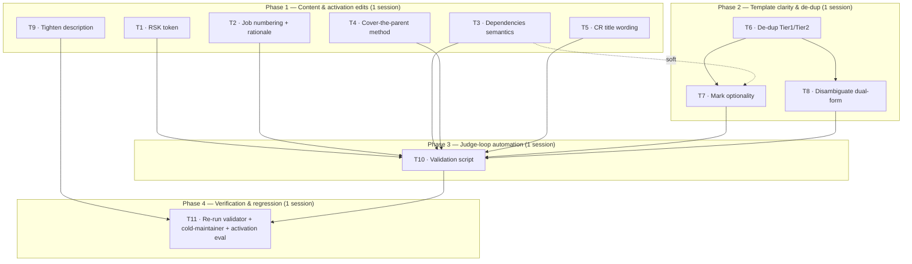

# Intent Skill — Implementation Plan

Addresses every Minor finding from the `agent-skill-review` of the `intent` skill: Lens 4 (M1–M3) and the Lens 5 cold-maintainer defects (D1–D7). Each finding maps to exactly one task. The DAG encodes dependencies; phases are sized to one working session each.

## Traceability: finding → task

| Task | Addresses | Source |
|---|---|---|
| T1 | D3 — `RSK` token defined only in `structure.md` | Lens 5 |
| T2 | D4 — jobs lack an assignment rule / template rationale | Lens 5 |
| T3 | D5 — `## Dependencies` semantics undefined | Lens 5 |
| T4 | D6 — "Cover the parent" has no judgment method | Lens 5 |
| T5 | D7 — CR title wording mismatch | Lens 5 |
| T6 | D2 — Tier-1/Tier-2 template duplication (drift) | Lens 5 |
| T7 | D1 — section optionality unmarked in templates | Lens 5 |
| T8 | M2 — dual-form templates risk double emission | Lens 4 |
| T9 | M1 — generic triggers may over-fire | Lens 4 |
| T10 | M3 — no bundled validation/coherence script | Lens 4 |
| T11 | verification (re-run validator, cold-maintainer, activation eval) | closes loop |

## Dependency DAG

Roots (no upstream deps): T1, T2, T3, T4, T5, T6, T9. The only intra-phase edges are `T6 → T7` and `T6 → T8` (settle the template structure before annotating it). `T3 → T7` is soft (annotation wording should reflect the finalized dependency semantics, but doesn't block).

---

## Phase 1 — Content & definition corrections

Independent reference/`SKILL.md` edits. No upstream deps; internally parallel.

- [ ] **T1 · Define the `RSK` token where risks are defined** — `references/elements.md` (Risk section) + cross-link to `structure.md#naming`. *Accept:* a reader learns the `O<NNN>-RSK<NNN>` id from the Risk definition without jumping to `structure.md`; `R` vs `RSK` distinction called out once.
- [ ] **T2 · Add jobs to the numbering rule and state the template rationale** — `references/structure.md#naming` Assignment bullet + a one-liner noting jobs are intentionally template-less (always Tier 0, rendered inline via `product.md`). *Accept:* `J<NNN>` scope (within product) is explicit; "no job template" reads as deliberate, not an omission.
- [ ] **T3 · Define `## Dependencies` semantics** — `assets/templates/requirement-document.md` note + one line in `references/elements.md`/`references/context-tracing.md`. *Accept:* the intended meaning (blocking? ordering? shared component?) is stated so two maintainers can't diverge.
- [ ] **T4 · Give "Cover the parent" a scoring-free method** — `references/elements.md#alignment-check`. *Accept:* a concrete procedure (enumerate the customer-defined dimensions of "better" for the parent; each must map to ≥1 sibling; an unmapped dimension = gap) replaces the bare assertion, consistent with the deliberate drop of ODI opportunity scoring.
- [ ] **T5 · Fix CR title placeholder wording** — `assets/templates/cr-document.md`, `assets/templates/cr-directory.md`. *Accept:* title uses `<CR Name>` to match every backlink render.
- [ ] **T9 · Tighten the description to curb over-fire** — `SKILL.md` frontmatter. *Accept:* generic triggers ("write a product spec", "define the customer's job") are anchored to the intent-tree context; still ≤1024 chars; validator re-run clean. (Eval deferred to T11.)

## Phase 2 — Template clarity & de-duplication

Depends on Phase 1 so annotations reflect corrected definitions. Do T6 first.

- [x] **T6 · Reduce Tier-1/Tier-2 template drift** — the `*-document.md`/`*-directory.md` pairs (requirement, outcome, component) and the CR/PDR/ADR doc/dir pairs. *Recommended default:* keep both files (each is a copy-paste artifact) but add a header comment in each `-directory` variant stating exactly how it differs from its Tier-1 sibling (link depth + added subsection) with a "keep the shared body in sync" note. *Accept:* the delta between each pair is explicit in-file; no silent duplication.
- [x] **T7 · Mark section optionality across spine templates** *(dep: T6; soft dep: T3)* — requirement, component, outcome, product, architecture templates. *Accept:* each section is marked required vs. omittable in-template (or a single top-of-file pointer to `structure.md`'s "Never emit an empty heading" rule), so optionality is knowable without cross-file inference.
- [x] **T8 · Disambiguate the dual-form templates** *(dep: T6)* — `assets/templates/product.md`, `assets/templates/architecture.md`, `assets/templates/outcome-directory.md` (Tier-2 requirements; `outcome-document.md` has no dual-form blocks). *Accept:* the back-to-back inline vs. reference blocks under identical headings carry a "pick one form per child" instruction, eliminating the double-emission risk.

## Phase 3 — Judge-loop automation

Depends on Phases 1–2 (the script encodes finalized content + template-structure rules).

- [ ] **T10 · Bundle a coherence/backlink linter** — new `scripts/` file + list it in `SKILL.md` "Available scripts" + wire into the `references/workflows.md` Judge loop. *Checks to encode:* logical-ID format/uniqueness/no-reuse, backlink bidirectionality, empty-heading rule, requirement-with-no-linked-risk (feature-request smell), CR stored on the correct tree side. *Accept:* runs non-interactively, PEP 723 / pinned deps, `--help`, JSON on stdout / diagnostics on stderr, meaningful exit codes; Judge loop references it as the mechanical first pass before human judgment.

## Phase 4 — Verification & regression

Depends on all prior tasks. This is the skill's own validate-and-fix loop applied to itself.

- [x] **T11 · Re-run the full review suite** — (1) `validate_skill.py` clean; (2) cold-maintainer test against a **fresh** subagent — target Q1–Q4 correct **and Q5 empty**; (3) activation eval for the T9 description (~20 labeled queries, near-miss-weighted). *Accept:* Q5 shrinks to empty (or only self-discounted observations remain); activation precision holds on near-misses. Feed any residual failures back as new tasks. → See `intent/evals/T11-verification-report.md` (PASS; 3 optional Minor follow-ups documented).

---

## Out of scope (deliberately not tasked)

The two Lens-5 items the cold maintainer self-classified as non-defects:

- The acknowledged brute-force `CR<NNN>` lookup across both `crs/` dirs — a known design tradeoff.
- The absence of a worked end-to-end example — a reasonable future enhancement (an optional Phase 1 task could add a sample `docs/` tree under `assets/`).
