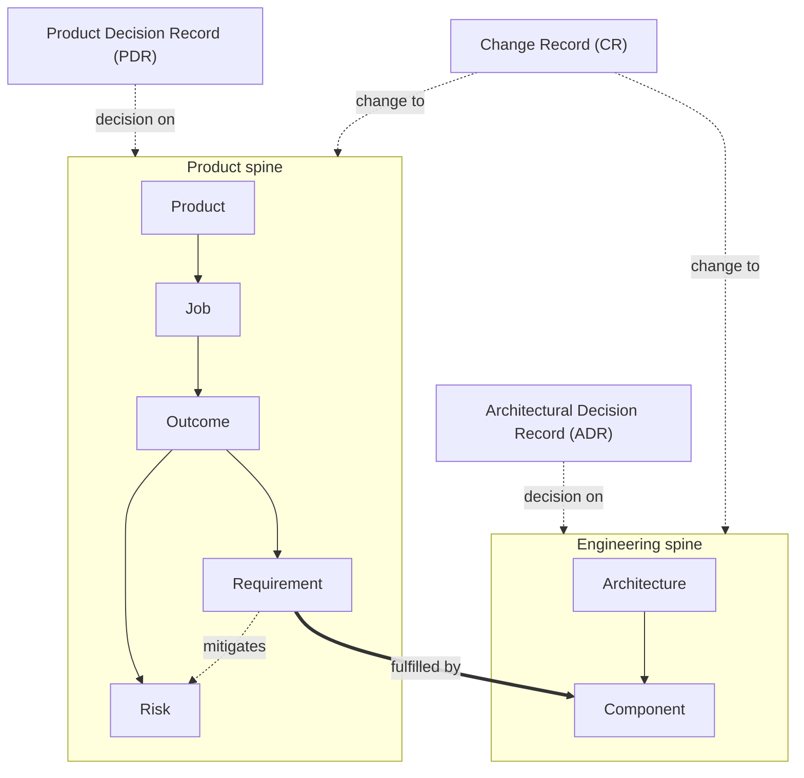

# intent

A single Go CLI (`intent`) that reads, validates, edits, and renders a **schema'd `intent.yaml`** describing your product and engineering intent as one traceable tree — so every component traces back to a requirement, every requirement to a risk, and every risk to a real customer outcome. `intent.yaml` is canonical; the markdown under `docs/` is generated and committed, so drift shows up in the diff instead of hiding in someone's head.

This repo dogfoods itself: [`intent.yaml`](intent.yaml) describes Intent using Intent, and [`docs/`](docs/) is what `intent build` renders from it.

## What you get

Two spines that connect product intent to how it's built:

- **Product** — Product, Jobs, Outcomes, Risks, Requirements
- **Engineering** — Architecture, Components

Plus **records** that keep the story coherent over time:

- **CR** (Change Record) — what changed and why
- **PDR** (Product Decision Record) — a product decision, its options, and consequences
- **ADR** (Architectural Decision Record) — the same, for engineering

Every element's snake_case key is its stable address (e.g. `product.jobs.<job>.outcomes.<outcome>.requirements.<requirement>`), so links survive even when there's no file yet.

The trace, at a glance:



Solid arrows are the current-state spine; the bold arrow is the one link that crosses from product to engineering; dashed arrows are records — point-in-time history and decisions, not structure. A PDR can decide on anything in the product spine, an ADR on anything in the engineering spine, and a CR can change anything on either — so each record points at the whole spine it scopes to, not one element.

## Starts small, grows only when needed

You don't scaffold a directory tree up front. Every outcome, requirement, and component starts `type: inline` — a few lines on its parent — and is promoted to its own document only when it earns one:

| `type` | On disk | Promote when… |
|---|---|---|
| `inline` (default) | a few lines on the parent's page | — |
| `document` | its own `<key>.md` page | it needs detail, edge cases, or its own records; `intent promote <addr>` |

A `document` with `document` children renders as a folder with a `README.md` landing page — directories are emergent, never authored. `intent promote` cascades every inline ancestor along with it (like `mkdir -p`), so a page never ends up orphaned under an inline parent.

## How to use it

Everything is written through the CLI, not by hand-editing `intent.yaml`:

```bash
intent find "drift"                  # search → addresses
intent show <addr>                   # an element + its outgoing edges
intent trace <addr> --depth 2        # its neighborhood
intent affects <addr>                # what points back at it (impact set)

intent add requirement <outcome> <key> --name "…" --statement "…" --mitigates <risk>
intent link dependsOn <req> <other-req>
intent record adr <key> --name "…" --summary "…" --affects engineering

intent validate                      # dangling refs, bad containment, out-of-domain records
intent build                         # render docs/ from intent.yaml
intent check                         # nonzero if docs/ has drifted from intent.yaml — the CI/pre-commit gate
```

Every write validates the whole tree before touching disk, so a bad edit is refused, not merely flagged. Run `intent help` for the task-first index — `intent help <slug>` reads a topic, `intent help E0NN` reads an error code — and `intent help --list` for a flat, greppable index of everything.

### The agent skill

`intent install-skill --agent <claude-code|agents-md>` renders an installable skill from the CLI's own embedded help content, so the skill and `intent help` can never disagree. Installed skill files are generated, not hand-maintained — reinstall after upgrading `intent` rather than editing them:

```bash
intent install-skill --agent claude-code   # writes .claude/skills/intent/
intent install-skill --agent agents-md     # writes AGENTS.md
```

## Install

Pinned via [`mise`](https://mise.jdx.dev) (see [`mise.toml`](mise.toml)):

```bash
mise install
mise exec -- intent --help
```

Once a release is tagged, `mise.toml` pins an exact `intent` version per project via the `ubi` backend, and `mise install` fetches that release binary — no separate install step, and switching projects switches versions automatically.

## Development

Go 1.25, pinned via `mise` — `mise install` sets up the toolchain.

```bash
go test ./...
go build -o bin/intent ./cmd/intent
```

To catch doc drift before it's pushed, enable the pre-commit hook once per clone:

```bash
git config core.hooksPath .githooks
```

It runs `intent check` whenever `intent.yaml` or `docs/` change and blocks the commit on drift. CI runs `intent validate` and `intent check` on every push and pull request.
